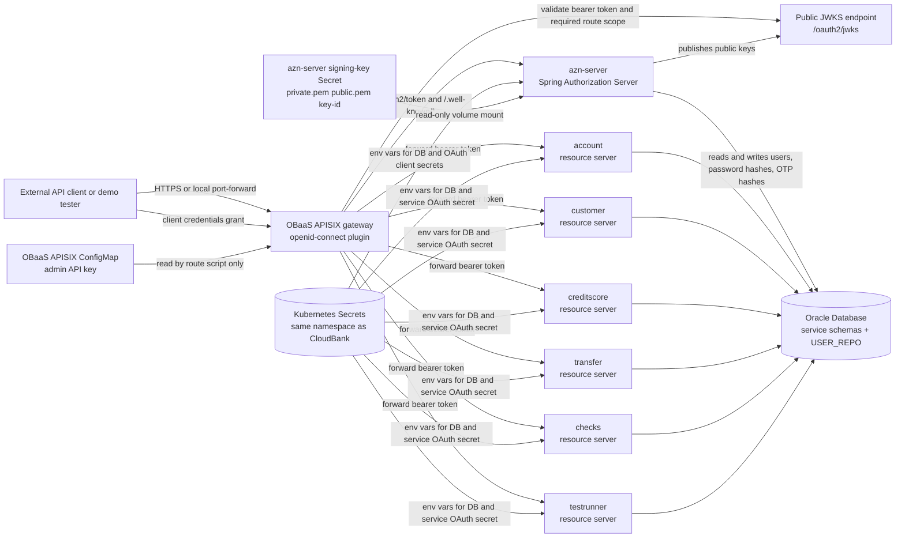
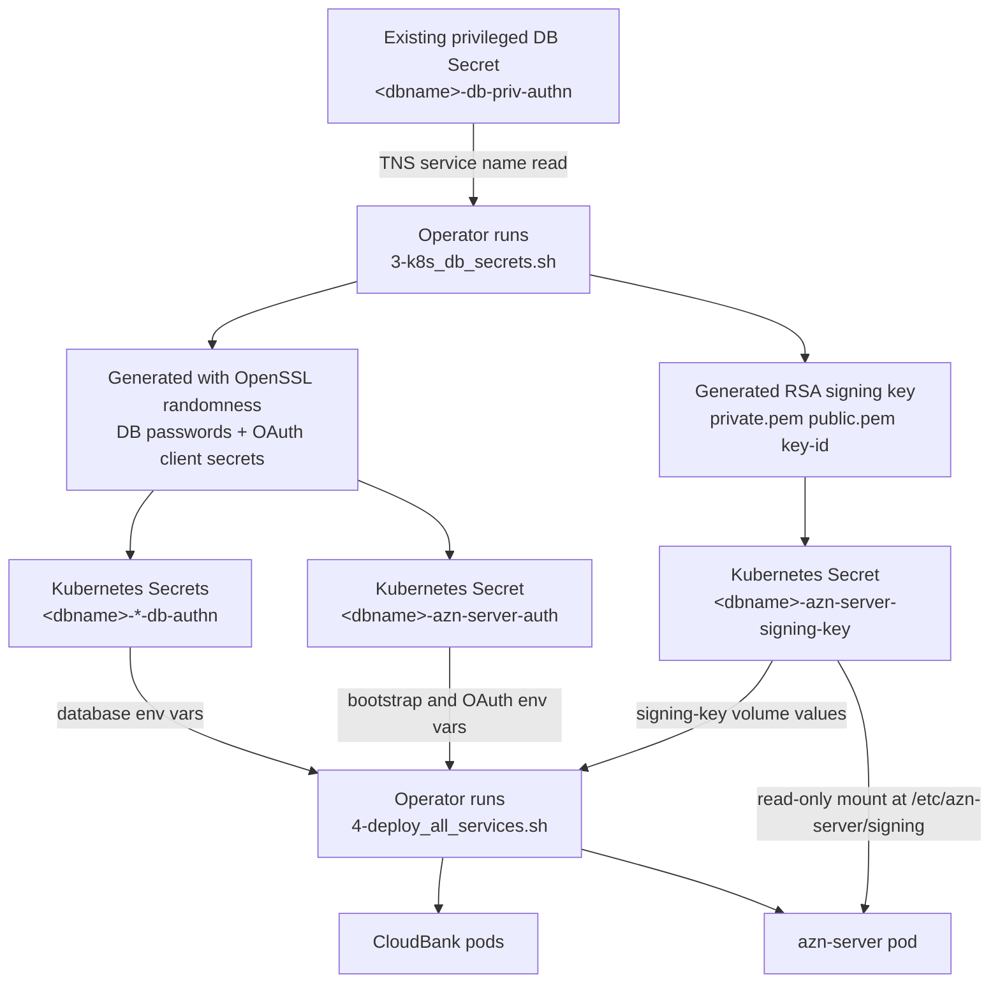
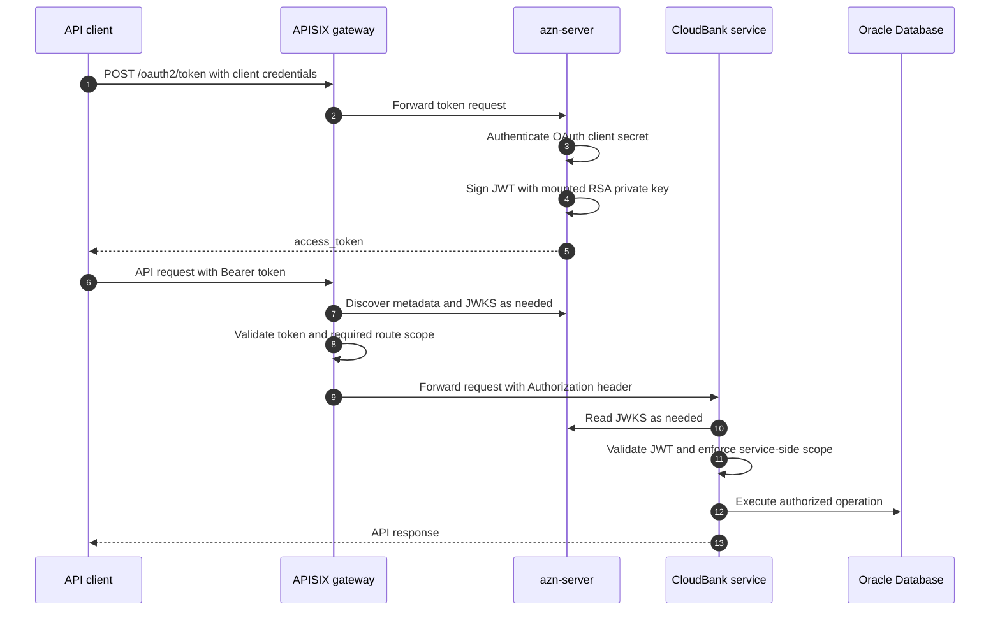
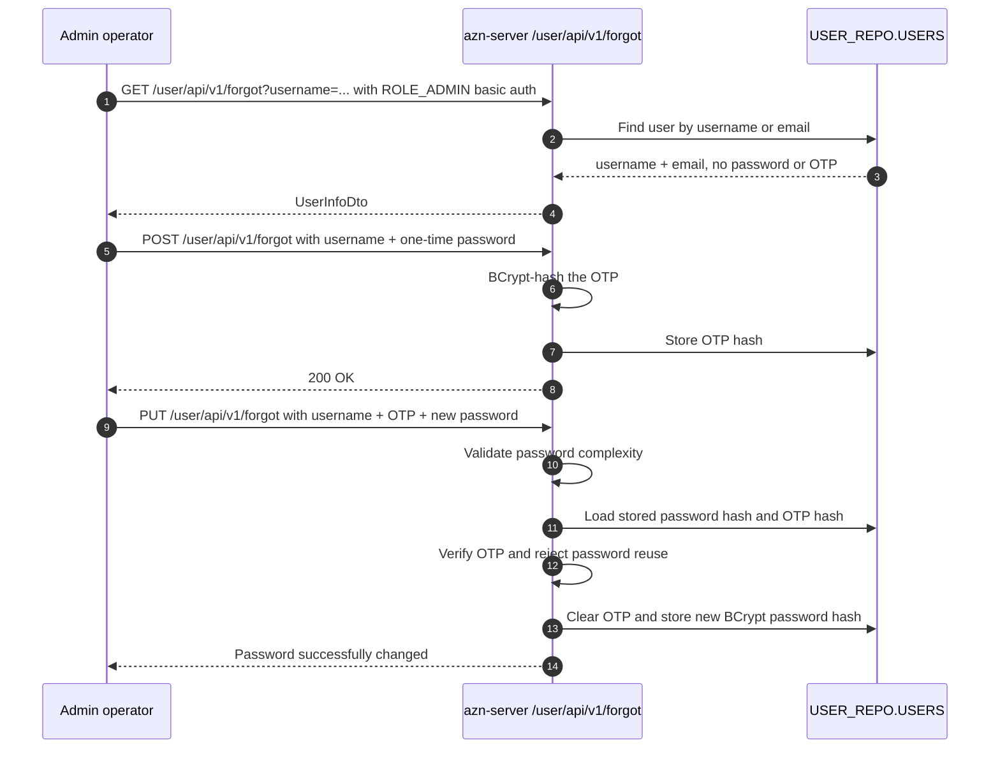

# CloudBank Version 5

CloudBank v5 is a reference application that demonstrates modern cloud-native microservices architecture using Oracle Backend as a Service (OBaaS). This comprehensive banking application showcases enterprise-grade distributed systems patterns, event-driven architecture, secured service-to-service calls, and production observability practices.

## 📦 Installation Guide

For complete installation instructions, see **[cloudbank-v5-install.md](cloudbank-v5-install.md)**

This guide covers:
- Building and containerizing the services
- Database setup with Oracle AI Autonomous Database
- Kubernetes deployment with Helm
- Spring Authorization Server and database secret setup
- Persistent `azn-server` signing-key setup for stable JWT verification across restarts
- Secured APISIX API gateway configuration
- OBaaS Java auto-instrumentation for observability
- Security scan status and residual findings in `security-posture-plan.md`

### 🧪 Testing Guide

For comprehensive testing procedures, see **[cloudbank-test-doc.md](cloudbank-test-doc.md)**

This guide covers:
- Getting OAuth2 access tokens from `azn-server`
- Running the automated secured smoke test with `6-smoke_test_secure_services.sh`
- Testing individual microservices with bearer tokens (account, customer, creditscore etc.)
- Check deposit and clearance workflow
- LRA distributed transaction testing (transfer service)
- Observability and tracing verification

## Security Architecture

CloudBank v5 is secured by a Spring Authorization Server service named `azn-server`, APISIX gateway route protection, and Spring Security resource-server checks in every in-scope Spring service. APISIX is a first line of defense for externally routed traffic, but the services still validate JWTs themselves.



### Security Components

| Component | Security responsibility |
|-----------|-------------------------|
| `azn-server` | Issues OAuth2 access tokens, publishes authorization metadata and JWKS, stores demo users in `USER_REPO`, and signs JWTs with the persistent signing key. |
| APISIX | Exposes public OAuth metadata/token routes, validates bearer tokens on CloudBank API routes, enforces route-level scopes, and forwards the bearer token to services. |
| Spring resource servers | Validate JWTs from `azn-server` and enforce service-side scopes. This remains the hard authorization boundary. |
| `common` module | Provides shared Spring Security auto-configuration and a service-token provider for internal service-to-service calls. |
| Kubernetes Secrets | Store database passwords, OAuth client secrets, bootstrap passwords, and persistent signing-key material. |
| Oracle Database | Stores application data and `USER_REPO.USERS`, including BCrypt password hashes and BCrypt OTP hashes. |

### Secrets

All CloudBank application secrets are Kubernetes Secrets in the CloudBank namespace. They are created by `3-k8s_db_secrets.sh` and consumed by `4-deploy_all_services.sh`.



| Secret | Key material | Used by | Update behavior |
|--------|--------------|---------|-----------------|
| `<dbname>-db-priv-authn` | Existing privileged DB username, password, service name | Secret-generation prerequisites and database bootstrap | Created outside this script. Rotate according to the database/admin process. |
| `<dbname>-azn-server-db-authn` | `USER_REPO` database password and service name | `azn-server` runtime database access | Preserved on normal reruns. With `--delete`, the secret is recreated but the existing username/password are reused unless `--rotate-db-passwords` is also supplied. |
| `<dbname>-account-db-authn` and other service DB secrets | Per-service DB password and service name | Runtime database access for each service | Preserved on normal reruns. With `--delete`, secrets are recreated but existing usernames/passwords are reused unless `--rotate-db-passwords` is also supplied. |
| `<dbname>-azn-server-auth` | `admin-password`, `user-password`, `client-secret`, `service-client-secret`, `test-client-secret`, `admin-client-secret` | `azn-server`, APISIX route setup, service-token provider, smoke tests | Recreated with `3-k8s_db_secrets.sh --delete`. Existing installs must recreate this secret if scoped client keys are missing. |
| `<dbname>-azn-server-signing-key` | `private.pem`, `public.pem`, `key-id` | JWT signing by `azn-server` | Preserved on normal reruns. Rotate intentionally with `--delete`; existing tokens become invalid. |
| `<obaas-release>-apisix` ConfigMap | APISIX admin API key | `5-apisix_create_routes.sh` | Managed by OBaaS, read by the route script to create/update APISIX routes. |

### Authentication And Authorization



APISIX authentication is configured by `5-apisix_create_routes.sh` using the APISIX `openid-connect` plugin in bearer-only mode. A caller first authenticates to `azn-server` at `/oauth2/token` with OAuth client credentials and receives a signed JWT access token. On later API calls, APISIX authenticates the request by validating the `Authorization: Bearer <token>` header against `azn-server` metadata and public keys from `/.well-known/openid-configuration` and `/oauth2/jwks`. APISIX checks the method-specific route's required scope, then forwards the same bearer token to the backend service. The backend service validates the JWT again and enforces its own service-side authorization.

The demo uses scoped OAuth clients instead of one all-powerful client:

| OAuth client | Secret key in `<dbname>-azn-server-auth` | Intended scopes |
|--------------|------------------------------------------|-----------------|
| `cloudbank-client` | `client-secret` | `cloudbank.read`, `cloudbank.write`, `cloudbank.transfer` |
| `cloudbank-service-client` | `service-client-secret` | `cloudbank.internal` |
| `cloudbank-test-client` | `test-client-secret` | `cloudbank.test` |
| `cloudbank-admin-client` | `admin-client-secret` | `cloudbank.admin` |

APISIX enforces route-level scopes for externally routed APIs. Services enforce the same or stricter policy internally. Internal service calls use `cloudbank-service-client` to obtain `cloudbank.internal` tokens, and APISIX blocks external access to internal account journal routes with a deny-style route that requires an unissued scope.

### Forgot Password Flow

The forgot-password endpoints are not exposed through APISIX. They are cluster-internal and require `ROLE_ADMIN` basic authentication on `azn-server`. The flow is intentionally admin-assisted for the demo because there is no external email/SMS delivery service.



Important boundaries:
- `/user/api/v1*` is not routed externally by `5-apisix_create_routes.sh`.
- Passwords and OTPs are never returned by the API and are stored only as BCrypt hashes.
- The reset flow should remain admin-only unless a real out-of-band OTP delivery service is added.

## Project Structure

```
cloudbank-v5/
├── azn-server/        # Spring Authorization Server for CloudBank tokens
├── account/           # Account management service
├── customer/          # Customer management service
├── transfer/          # Money transfer orchestration service
├── checks/            # Check processing service
├── creditscore/       # Credit scoring service
├── testrunner/        # Testing utility service
├── common/            # Shared configuration and utilities
└── buildtools/        # Code quality tools (checkstyle, dependency-check)
```
