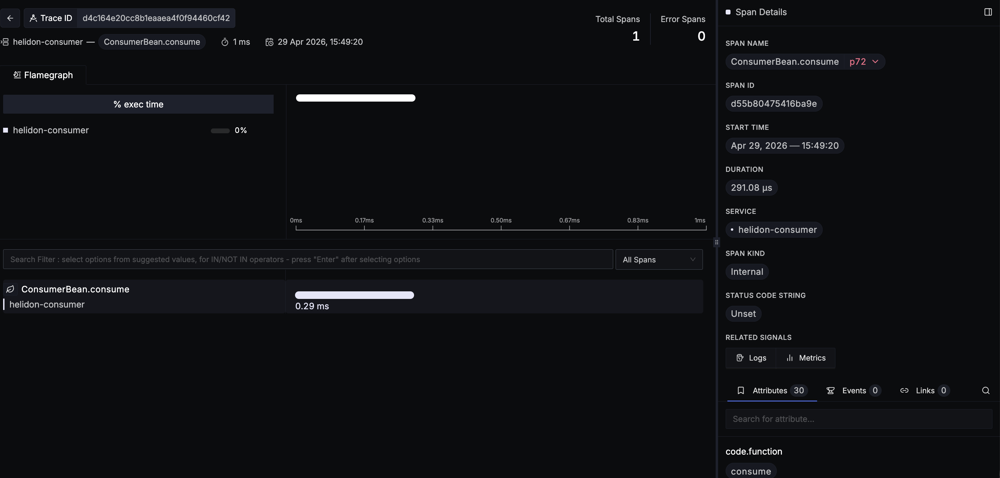
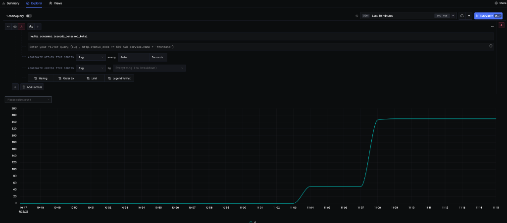

# Helidon Consumer Microservice

This project is a Helidon 4.4.1 MP microservice that consumes messages from an Oracle Backend for Spring Boot and Microservices (OBaaS) managed Kafka cluster. It is fully instrumented with OpenTelemetry to provide zero-touch distributed tracing, log correlation, and Kafka metric collection in SigNoz.

## Helidon 4.4 Kafka Consumption

This microservice is built using **MicroProfile Reactive Messaging**, which is the standard, declarative way to integrate with Kafka in Helidon MP 4.4. 

Key paradigms used in this architecture include:
*   **Declarative Receiving**: Instead of writing manual `KafkaConsumer.poll()` loops, we use the `@Incoming("from-kafka")` annotation on a bean method. Helidon's Reactive Messaging engine automatically handles the polling, deserialization, and thread management.
*   **Automatic Acknowledgment**: The service is configured to automatically acknowledge (commit) offsets once the method successfully completes. For more control, the method can return a `CompletionStage<Void>` to handle asynchronous processing.
*   **Virtual Threads**: Helidon 4 runs entirely on Java 21 Virtual Threads. When the consumer is waiting for new messages or performing I/O, it unmounts the virtual thread, allowing the application to handle thousands of concurrent operations with minimal resource footprint.

## Configuring Kafka Metrics Collection

OBaaS automatically handles the injection of the OpenTelemetry Java Agent into the pod when deployed via the local Helm chart. 

To capture low-level Kafka client metrics, ensure the following environment variables are defined in your `values.yaml`:

```yaml
env:
  - name: OTEL_SERVICE_NAME
    value: "helidon-consumer"
  - name: OTEL_INSTRUMENTATION_KAFKA_METRICS_ENABLED
    value: "true"
```
The `OTEL_INSTRUMENTATION_KAFKA_METRICS_ENABLED` flag instructs the Java Agent to capture Kafka JMX metrics and export them as OTLP metrics to the SigNoz collector.

## Available Kafka Consumer Metrics

Once processing starts, the following key metrics are available in the SigNoz **Metrics Explorer**:

*   **`kafka.consumer.records_consumed_total`**: The total number of messages processed (use `rate()` to see messages per second).
*   **`kafka.consumer.fetch_manager.records_lag_max`**: The maximum number of messages waiting in the queue (Consumer Lag).
*   **`kafka.consumer.fetch_manager.fetch_latency_avg`**: The average time spent fetching messages from the broker.
*   **`kafka.consumer.connection_count`**: The number of active connections to the Kafka cluster.

## Building and Deploying to OBaaS

### 1. Build the Application
Use Maven to compile the application and build the container image:
```bash
mvn clean package -DskipTests
docker build -t REGION.ocir.io/tenancy/cloudbank-v5/helidon-consumer:5.0-SNAPSHOT .
```

### 2. Deploy using Helm
Deploy the service using the local OBaaS sample app chart:
```bash
helm upgrade --install helidon-consumer ../../helm/app-charts/obaas-sample-app \
  -f values.yaml \
  -n obaas
```

## Observability Dashboards

Below are examples of the observability automatically provided by this configuration in SigNoz.

### Distributed Traces (Flamegraph)
The application automatically captures spans for message processing. Using the `Message<String>` wrapper and `@WithSpan` annotation, the system provides high-resolution timing for the `consume` operation.



### Consumer Infrastructure Metrics
Real-time monitoring of the underlying Kafka consumer client, including connection counts and fetch performance.



## Log-Trace Correlation

This project is configured for full **Log-Trace Correlation**, allowing you to jump from a specific log message directly to the trace that generated it.

*   **Structured JSON Logging**: Logs are output as structured JSON using the `LogstashEncoder`.
*   **JUL-to-SLF4J Bridge**: Internal Helidon logs are routed to Logback to ensure consistent formatting and context injection.
*   **Context Injection**: The OTEL agent automatically injects the `trace_id` and `span_id` into every log entry, which SigNoz uses to link logs to the corresponding trace.
