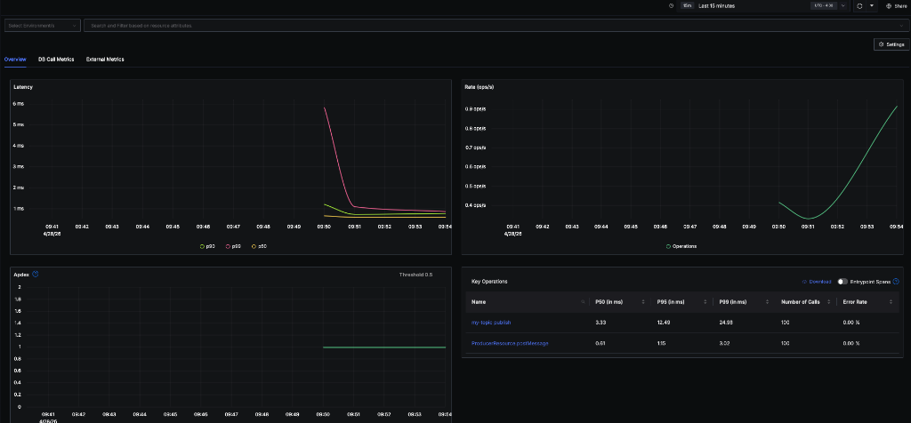
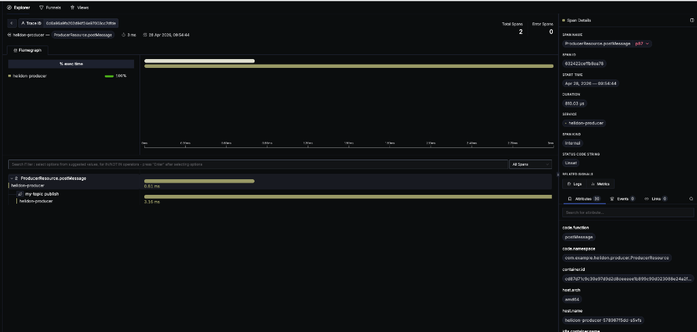
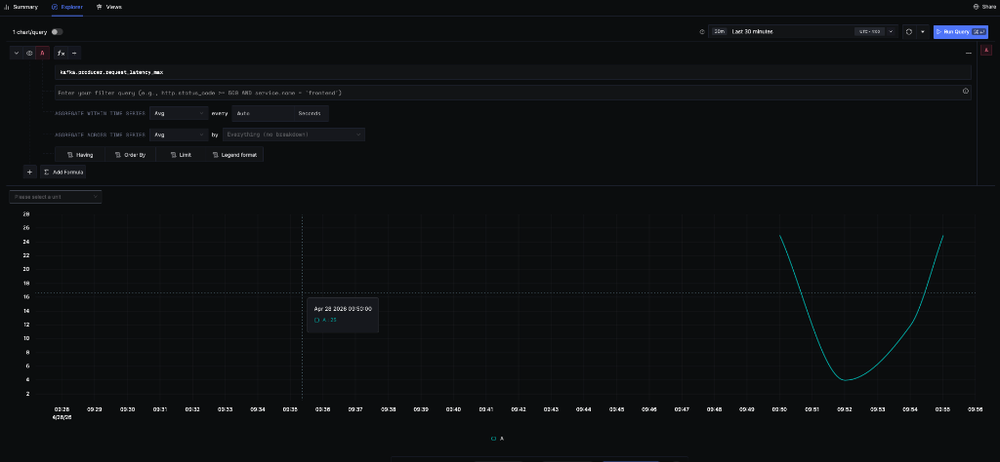

# Helidon Producer Microservice

This project is a Helidon 4.4.1 MP microservice that provides a REST API to produce messages to an Oracle Backend for Spring Boot and Microservices (OBaaS) managed Kafka cluster. It is fully instrumented with OpenTelemetry to provide zero-touch distributed tracing and Kafka metric collection in SigNoz.

## Helidon 4.4 Kafka Integration

This microservice is built using **MicroProfile Reactive Messaging**, which is the standard, declarative way to integrate with Kafka in Helidon MP 4.4. 

Key paradigms used in this architecture include:
*   **Declarative Channels**: Instead of writing raw `KafkaProducer` boilerplate code, we use the `@Outgoing("my-channel")` annotation on a Reactive Streams emitter. Helidon's Reactive Messaging engine automatically handles the underlying Kafka connections, connection pooling, and message serialization.
*   **MicroProfile Config**: The mapping between the logical `"my-channel"` channel and the actual Kafka topic and broker is handled entirely in `META-INF/microprofile-config.properties` (or `application.yaml`). This allows us to dynamically inject Kubernetes environment variables (like `KAFKA_BOOTSTRAP_SERVERS`) at runtime without changing any Java code.
*   **Virtual Threads**: Helidon 4 runs entirely on Java 21 Virtual Threads (the Níma web server). When the underlying Kafka client performs blocking I/O (like waiting for a broker acknowledgment), it simply unmounts the virtual thread without blocking the OS carrier thread, resulting in extremely high throughput and low resource utilization.

## Configuring Kafka Metrics Collection

OBaaS automatically handles the injection of the OpenTelemetry Java Agent into the pod when deployed via the local Helm chart. 

To specifically capture low-level Kafka client metrics, you must define the following environment variables in your `values.yaml`:

```yaml
env:
  - name: OTEL_SERVICE_NAME
    value: "helidon-producer"
  - name: OTEL_INSTRUMENTATION_KAFKA_METRICS_ENABLED
    value: "true"
```
The `OTEL_INSTRUMENTATION_KAFKA_METRICS_ENABLED` flag instructs the Java Agent to capture JMX/Kafka metrics and export them as OTLP metrics to the OBaaS OpenTelemetry Collector.

## Available Kafka Producer Metrics

Once traffic is generated, the following key metrics will be available in the SigNoz **Metrics Explorer**:

*   **`kafka.producer.record_send_rate`**: The average number of records sent per second.
*   **`kafka.producer.request_latency_max`**: The maximum time (in ms) it took for the Kafka broker to acknowledge a message.
*   **`kafka.producer.outgoing_byte_rate`**: The actual data throughput in bytes per second.
*   **`kafka.producer.records_per_request_avg`**: How well messages are being batched together.
*   **`kafka.producer.record_error_rate`**: The average number of errors per second (should always be 0).

*(Note: Depending on your exact OpenTelemetry agent version, these metrics may alternatively appear as `messaging.kafka.producer.*`).*

## Determining the Kafka Bootstrap Server

When running in Kubernetes with Strimzi, you should never connect directly to the individual broker pods (e.g., `obaas-kafka-cluster-dual-role-0`). Instead, connect to the stable **Bootstrap Service** created by the operator.

The Strimzi operator names the bootstrap service using the formula: `[Kafka-Resource-Name]-kafka-bootstrap`.

You can dynamically find this service in your namespace by running:
```bash
kubectl get svc -n obaas | grep bootstrap
```

In our environment, the service is `obaas-kafka-cluster-kafka-bootstrap`, and we use port `9092` for internal, unencrypted traffic:
```yaml
  - name: KAFKA_BOOTSTRAP_SERVERS
    value: "obaas-kafka-cluster-kafka-bootstrap:9092"
```

## Building and Deploying to OBaaS

This service is deployed using the standard OBaaS Helm chart pattern to ensure consistency with other platform services.

### 1. Build the Application
Use Maven to compile the application and build the container image:
```bash
mvn clean package k8s:build k8s:push -Dimage.registry=REGION.ocir.io/tenancy/cloudbank-v5 -Dimage.tag=5.0-SNAPSHOT
```

### 2. Deploy using Helm
Deploy the service using the published OBaaS sample app chart:
```bash
helm upgrade --install helidon-producer obaas/obaas-sample-app \
  -f values.yaml \
  -n obaas
```

### 3. Testing the Endpoint
You can verify the deployment using the included `./test-endpoints.sh` script. This script automates the full authentication and delivery flow:
1. Reads the service client credentials from the supplied `*-azn-server-auth` secret. If the secret name is omitted, the script continues only when the namespace contains exactly one matching secret.
2. Uses port-forwarding to request an OAuth2 bearer token from `azn-server`.
3. Port-forwards `helidon-producer`, sends an authenticated `POST /post`, and verifies that it returns HTTP `200`.

```bash
./test-endpoints.sh obaas localhost:18080 helmtest-azn-server-auth
```

The script defaults to local ports `19081` for `azn-server` and `18080` for
`helidon-producer`, and fails clearly if either requested port is already in
use. Set `AZN_LOCAL_PORT` or pass a different producer URL when needed.

### 4. Security Context Requirements
When deploying to OBaaS, the environment enforces strict Pod Security Standards. The OpenTelemetry operator injects an init container to copy the Java agent, which will fail with a `CreateContainerConfigError` if it attempts to run as root.

You must explicitly configure the Pod's security context in `values.yaml` to use Helidon's standard non-root user (UID `185`):

```yaml
podSecurityContext:
  runAsNonRoot: true
  runAsUser: 185
  runAsGroup: 0
  fsGroup: 0
```

### 5. JWT Security Validation
The OBaaS authorization server (`azn-server`) issues permissions via the `scope` claim rather than the `groups` claim expected by standard Jakarta `@RolesAllowed`. 

To properly secure endpoints, the `helidon-producer` uses:
1.  **`@Authenticated`**: Ensures a valid MP-JWT is present without enforcing rigid group mapping.
2.  **Manual Scope Checking**: Injects the `JsonWebToken` and checks for the required scope (e.g., `cloudbank.internal`) manually within the endpoint code.
3.  **Dynamic Issuer Verification**: MicroProfile JWT compares the token issuer exactly. CloudBank configures `azn-server` with the namespace-qualified issuer `http://azn-server.<namespace>.svc.cluster.local:8080`, so the producer must use the same value. The Helm values obtain the namespace through the Kubernetes Downward API and configure both issuer and JWK URI:
    ```yaml
    env:
      - name: POD_NAMESPACE
        valueFrom:
          fieldRef:
            fieldPath: metadata.namespace
      - name: MP_JWT_VERIFY_ISSUER
        value: "http://azn-server.$(POD_NAMESPACE).svc.cluster.local:8080"
      - name: CLOUDBANK_SECURITY_JWK_SET_URI
        value: "http://azn-server.$(POD_NAMESPACE).svc.cluster.local:8080/oauth2/jwks"
    ```

    For non-Kubernetes execution, set `MP_JWT_VERIFY_ISSUER` and `CLOUDBANK_SECURITY_JWK_SET_URI` explicitly before starting the application.

## Observability Dashboards

Below are examples of the observability automatically provided by this configuration in SigNoz.

### Service Overview Dashboard
Automatically generated RED (Rate, Errors, Duration) metrics tracking both the REST endpoint (`ProducerResource.postMessage`) and the Kafka publish operation (`my-topic publish`).



### Distributed Traces (Flamegraph)
End-to-end trace context propagation showing the REST HTTP request wrapping the Kafka producer send operation in a single unified trace.



### Custom Kafka Metrics
Direct visualization of the OpenTelemetry Kafka Producer metrics (e.g., `kafka.producer.request_latency_max`) grouped by `service_name`.



## Log-Trace Correlation

This project is configured for full **Log-Trace Correlation** in SigNoz, allowing you to jump from a specific log message directly to the trace that generated it.

### Implementation Details:
*   **Structured JSON Logging**: The application uses `logback.xml` with the `LogstashEncoder` to output logs as structured JSON instead of plain text.
*   **JUL-to-SLF4J Bridge**: We use the `jul-to-slf4j` bridge and the `ProducerApplication` class to intercept Helidon's internal `java.util.logging` calls. This ensures that even internal Helidon logs follow our JSON format.
*   **Automatic Context Injection**: The OpenTelemetry Java Agent automatically injects the active `trace_id` and `span_id` into the Logback Mapped Diagnostic Context (MDC) for every log entry.
*   **SigNoz Integration**: SigNoz parses these JSON fields and automatically provides a "View Trace" button in the log details view, enabling seamless navigation between your logs and distributed traces.
